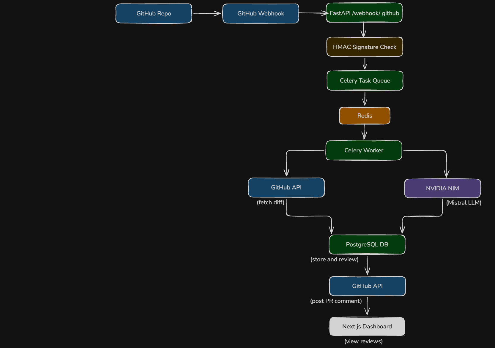

# 📖 CodeReviewBot — Technical Documentation

---

## Architecture Overview



### Color Legend
| Color | Represents |
|-------|-----------|
| 🔵 Blue | GitHub components |
| 🟢 Green | Backend (FastAPI, Celery, PostgreSQL) |
| 🟠 Orange | Infrastructure (Redis) |
| 🟣 Purple | AI layer (NVIDIA NIM / Mistral) |
| 🟡 Yellow | Security (HMAC verification) |
| ⚫ Black | Frontend (Next.js) |

---

## System Flow

```
GitHub PR opened/updated
        ↓
POST /webhook/github (FastAPI)
        ↓
HMAC-SHA256 signature verified
        ↓
Job enqueued → Celery via Redis
        ↓
200 returned to GitHub immediately (avoids 10s timeout)
        ↓
Celery Worker picks up job
        ↓
Idempotency check via Redis key (skip if already reviewed this commit SHA)
        ↓
GitHub API → fetch PR diff files
        ↓
Diff filter (skip lock files, generated files, files > 500 lines)
        ↓
Structured prompt built → sent to NVIDIA NIM (Mistral)
        ↓
JSON response parsed and validated
        ↓
Review stored in PostgreSQL
        ↓
GitHub API → post comment on PR
        ↓
Next.js dashboard → view all reviews
```

---

## Module Breakdown

### `app/api/webhook.py` — Webhook Receiver
- Receives `POST /webhook/github` from GitHub
- Verifies HMAC-SHA256 signature immediately (rejects unverified requests)
- Parses PR metadata (repo, PR number, commit SHA, author)
- Enqueues Celery task and returns `200` immediately
- Only processes `pull_request.opened` and `pull_request.synchronize` events

### `app/core/security.py` — HMAC Verification
- Reads `X-Hub-Signature-256` header from GitHub request
- Computes expected signature using shared secret from `.env`
- Uses `hmac.compare_digest()` for timing-safe comparison
- Raises `401` if signature is missing or invalid

### `app/workers/tasks.py` — Celery Worker
- Async task that runs the full review pipeline
- Checks Redis idempotency key (`review:{owner}/{repo}:{commit_sha}`) — skips if already processed
- Looks up repo token from PostgreSQL
- Calls GitHub API, diff filter, LLM, stores result, posts comment
- Retries up to 3 times on failure

### `app/services/github.py` — GitHub API Client
- `get_pr_files()` — fetches list of changed files with diffs via GitHub REST API
- `post_pr_comment()` — posts the formatted review as a PR comment
- Uses GitHub Personal Access Token for authentication

### `app/services/diff_filter.py` — Diff Filter
- Skips generated files: `package-lock.json`, `yarn.lock`, `dist/`, `build/`, `.min.js` etc.
- Skips files with more than 500 lines of diff (token budget management)
- Builds a structured prompt string from filtered diffs

### `app/services/llm.py` — LLM Integration
- Uses OpenAI SDK pointed at NVIDIA NIM base URL (compatible API)
- Model: `mistralai/mistral-medium-3.5-128b` (free tier, 128k context window)
- Temperature set to `0.2` for consistent, deterministic JSON output
- Strips markdown code fences from response defensively
- Returns `(findings, tokens_used)` tuple

### `app/services/formatter.py` — Review Formatter
- Formats findings into GitHub-flavoured markdown
- Groups findings by severity: Critical → Major → Minor → Suggestion
- Appends model name and token count as footer

### `app/models/models.py` — Database Models
Three tables:
- `repos` — registered repos and their GitHub tokens
- `pull_requests` — PR metadata (number, SHA, title, author)
- `reviews` — findings JSON, model name, tokens used, timestamp

### `app/api/repos.py` — Repo Management API
- `POST /repos` — register a new repo with GitHub token
- `GET /repos` — list all registered repos
- `GET /repos/{id}/stats` — PR count and review count for a repo

### `app/api/reviews.py` — Reviews Query API
- `GET /reviews/{pr_id}` — fetch all reviews for a given PR

---

## Key Engineering Decisions

### 1. Immediate 200 + Async Processing
GitHub times out webhooks after **10 seconds**. The webhook handler returns `200` immediately and enqueues the heavy work to Celery. This is the correct pattern for any webhook-driven system.

### 2. HMAC Signature Verification
Every incoming webhook is verified against `X-Hub-Signature-256` before any processing. This ensures only GitHub can trigger reviews — not arbitrary HTTP requests. Uses timing-safe comparison to prevent timing attacks.

### 3. Idempotency via Redis
Redis key `review:{owner}/{repo}:{commit_sha}` with 24h TTL prevents duplicate reviews when GitHub re-delivers a webhook. This is critical for reliability in production systems.

### 4. Structured LLM Output
The prompt instructs the model to return **only a JSON array** with a strict schema. Low temperature (`0.2`) ensures consistent output. Defensive parsing handles cases where the model wraps output in markdown fences despite instructions.

### 5. Diff Filtering + Token Budget
Skip lock files and generated files to avoid wasting tokens on irrelevant content. Cap at 500 lines per file to stay within context window limits. This shows cost-awareness — a rare quality in student AI projects.

### 6. Token Usage Tracking
Every review stores `tokens_used` in the database. This enables cost analysis over time and demonstrates production-level thinking.

---

## Database Schema

```sql
CREATE TABLE repos (
    id SERIAL PRIMARY KEY,
    owner VARCHAR(100),
    name VARCHAR(100),
    github_token VARCHAR(255),
    created_at TIMESTAMP DEFAULT NOW()
);

CREATE TABLE pull_requests (
    id SERIAL PRIMARY KEY,
    repo_id INTEGER REFERENCES repos(id),
    pr_number INTEGER,
    commit_sha VARCHAR(40),
    title TEXT,
    author VARCHAR(100),
    created_at TIMESTAMP DEFAULT NOW()
);

CREATE TABLE reviews (
    id SERIAL PRIMARY KEY,
    pr_id INTEGER REFERENCES pull_requests(id),
    findings JSON,
    model VARCHAR(50),
    tokens_used INTEGER,
    created_at TIMESTAMP DEFAULT NOW()
);
```

---

## LLM Prompt Design

```
System:
You are an expert code reviewer. Analyze the provided diff and return ONLY 
a valid JSON array. Each item must have:
{
  "file": string,
  "line": number|null,
  "severity": "critical"|"major"|"minor"|"suggestion",
  "issue": string,
  "suggestion": string
}
Return [] if no issues found. No markdown, no explanation — raw JSON only.

User:
Review this diff:
### bad_code.py (modified)
```diff
... diff content here ...
```
```

---

## API Endpoints

| Method | Endpoint | Description |
|--------|---------|-------------|
| `POST` | `/webhook/github` | Receive GitHub webhook events |
| `POST` | `/repos` | Register a new repo |
| `GET` | `/repos` | List all registered repos |
| `GET` | `/repos/{id}/stats` | Get PR and review stats for a repo |
| `GET` | `/reviews/{pr_id}` | Get all reviews for a PR |
| `GET` | `/health` | Health check |

---

## Module Mapping to University Courses

| Module | Course Relevance |
|--------|-----------------|
| Webhook architecture + async pattern | Advanced Software Architecture |
| HMAC security, credential management | DevOps & SecOps / Network Security |
| Structured LLM output, prompt engineering | Intelligent Systems / AI Laboratory |
| Token budget, output validation | MLOps / Advanced Deep Learning |
| Docker, event-driven design | Cloud Computing / Cloud Technologies |
